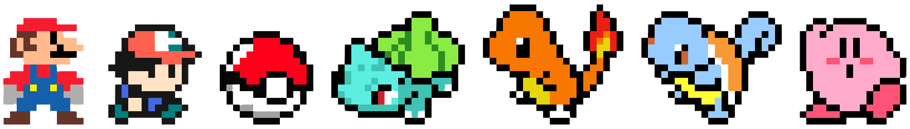

  

 <picture>
        <source media="(prefers-color-scheme: dark)" srcset="github-snake-dark.svg" />
        <source media="(prefers-color-scheme: light)" srcset="github-snake.svg" />
        
 </picture>

# Hi there, I'm Jackey Gao! 👋

## About Me

I'm a passionate software developer with a love for creating innovative solutions and improving existing systems. I enjoy working with a variety of programming languages and technologies, and I'm always eager to learn and explore new areas in the tech world.

- 🔭 I’m currently working on multiple projects involving web development and data science.
- 🌱 I’m currently learning more about machine learning and cloud computing.
- 👯 I’m looking to collaborate on open-source projects.
- 💬 Ask me about anything related to web development, Python, or data analysis.
- 📫 How to reach me: [jackeygao@example.com](mailto:jackeygao@example.com)
- ⚡ Fun fact: I love hiking and exploring new trails in my free time.

## Languages and Tools

- **Languages:** Python, JavaScript, HTML, CSS, SQL
- **Frameworks and Libraries:** React, Node.js, Django, Flask, Pandas
- **Tools:** Git, Docker, VS Code, Jupyter Notebook

## GitHub Stats

## Projects

### Project 1: chinese-poetry
- **Description:** The most comprehensive database of Chinese poetry.
- **Repository:** [Chinese Poetry Project([https://github.com/jackeyGao/web-development-project](https://github.com/chinese-poetry/chinese-poetry))

> 💬 微信: gaojunqi26 请备注来源:(Github)

<!--
**jackeyGao/jackeyGao** is a ✨ _special_ ✨ repository because its `README.md` (this file) appears on your GitHub profile.
Here are some ideas to get you started:

- 🔭 I’m currently working on ...
- 🌱 I’m currently learning ...
- 👯 I’m looking to collaborate on ...
- 🤔 I’m looking for help with ...
- 💬 Ask me about ...
- 📫 How to reach me: ...
- 😄 Pronouns: ...
- ⚡ Fun fact: ...
-->
